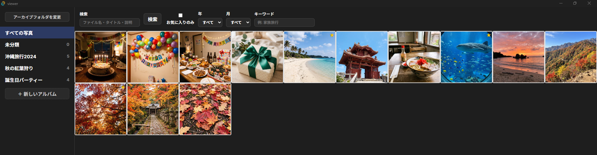
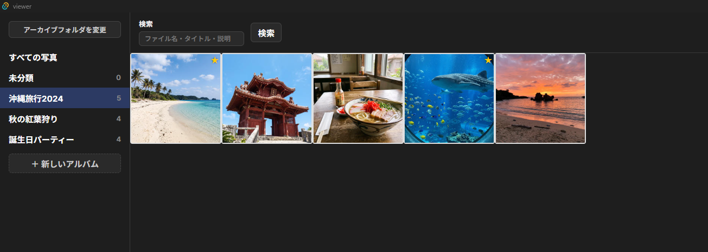
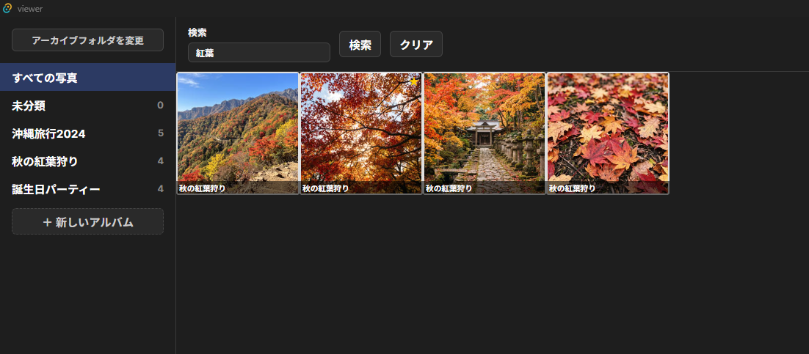
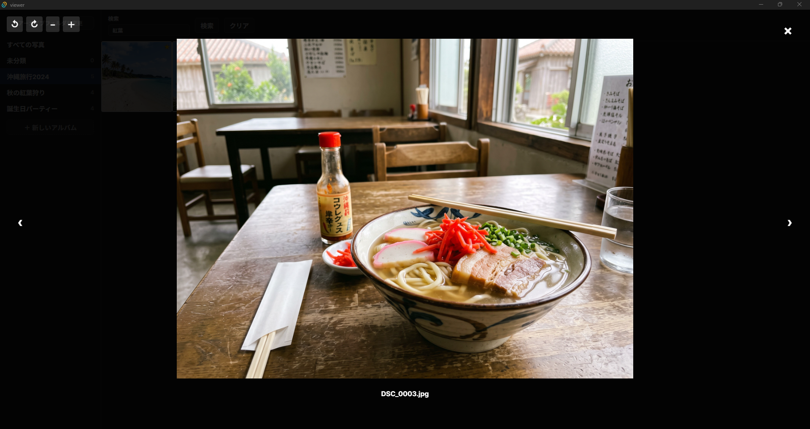

# photolibre

Apple Photos/iPhotoの独自仕様から写真を解放し、オープンな形式（SQLite + XMPサイドカー）で管理する、クロスプラットフォーム対応の写真アーカイブ・閲覧ツールです。

古いiMac（macOS Big Sur以前）に長年溜め込んだ写真を、Windows/Linux/NASなど別の環境でも自由に閲覧・管理できるようにすることを目指しています。

> 掲載しているスクリーンショットはすべてAI生成のサンプル画像で、実在の人物・実写真は一切含まれていません。

---

## 現在の進捗

| フェーズ | 状態 |
|---|---|
| Phase 1: iMacからのエクスポート | ✅ 完了（osxphotosベースの手順を確立） |
| Phase 2: インポーター（archive.db構築） | ✅ 完了（TDD・テストカバレッジ98%） |
| Phase 2.5: 実データでの検証 | ✅ 完了（Source A 3,545件・Source B 2,990件、全件取り込み） |
| Phase 3: 閲覧アプリ（Tauri + React） | ✅ 主要機能完成・実機動作確認済み |
| 結合テスト・セキュリティレビュー・ドキュメント整備・ライセンス選定 | ✅ 完了 |

Source A（Photos.app）3,556枚・Source B（iPhoto、1998〜2016年分含む）2,990枚、合計6,535件の実データで動作検証済みです。

---

## スクリーンショット

### 全体表示（写真一覧・グリッドビュー）

### アルバム表示

### 検索（ファイル名だけでなく、所属アルバム名でも検索可能）

### フルスクリーン表示（拡大縮小・回転対応）

---

## 主な機能

**インポーター（`importer/`）**

- osxphotosでエクスポートしたPhotos.app（Source A）・iPhoto（Source B）両方のライブラリを1つのアーカイブへ統合
- SHA-256ハッシュによる重複写真の自動検出（削除はせず`_duplicates/`へ非破壊で退避）
- アルバム名の完全一致・部分集合関係を検出して自動統合（Unicode正規化の違いにも対応）
- 原本ファイルへの書き込みは一切行わない読み取り専用設計

**閲覧アプリ（`viewer/`）**

- 写真グリッド表示・アルバム一覧・「未分類」専用ビュー
- フルスクリーン表示（拡大縮小はボタン・Ctrl+マウスホイール両対応、カーソル位置基準ズーム、ドラッグでのパン移動）
- 写真の手動回転（EXIF自動補正＋手動調整、非破壊）
- お気に入り・年月・キーワードでの絞り込み、ファイル名／タイトル／説明／アルバム名を横断する検索
- アルバムの手動作成・リネーム、複数選択してのドラッグ&ドロップによる写真の分類・未分類への差し戻し
- 上記の分類操作はすべてCtrl+Zで取り消し可能（Undo）
- 動画ファイルはOS標準の動画プレイヤーで再生

---

## 技術スタック

| 項目 | 内容 |
|---|---|
| インポーター（`importer/`） | Python 3.11+（TDD、pytest、カバレッジ98%） |
| 閲覧アプリ（`viewer/`） | Tauri 2.x（Rust）+ React 19 + TypeScript（TDD、Rust 53テスト・フロントエンド99テスト） |
| データ形式 | SQLite（`archive.db`）+ XMPサイドカー |

---

## 設計方針: 非破壊

写真の原本ファイルは、インポーター・閲覧アプリのどちらからも一切変更しません。

- 重複写真の削除は行わず、`_duplicates/`へ退避して対応関係のみ記録
- 写真の回転は元ファイルを書き換えず、`archive_root/.viewer_state/`に回転角度を別途記録
- 閲覧アプリで行うアルバム分類（作成・リネーム・写真の追加/除外）は`archive.db`内のメタデータのみを更新し、写真ファイル自体には触れない
- アルバムの削除機能は、誤操作のリスクが大きいためアプリ上には意図的に用意していない

---

## セットアップ・使い方

1. [iMac（macOS）側: 写真ライブラリのエクスポート](docs/01-export-macos.md)
2. [Windows側: インポートとビュワーでの閲覧](docs/02-import-and-view-windows.md)

---

## ライセンス

[GNU General Public License v3.0](LICENSE)

誰でも無料で自由に使用・改変・再配布できますが、改変版を配布する場合はそのソースコードも同じGPL v3で公開する必要があります（コピーレフト）。これにより、本プロジェクトが取り込まれてクローズドソースの有料製品として販売されることを防いでいます。
