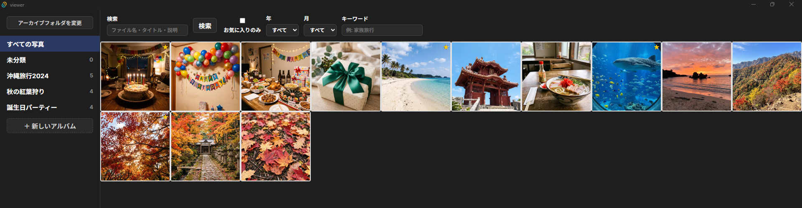
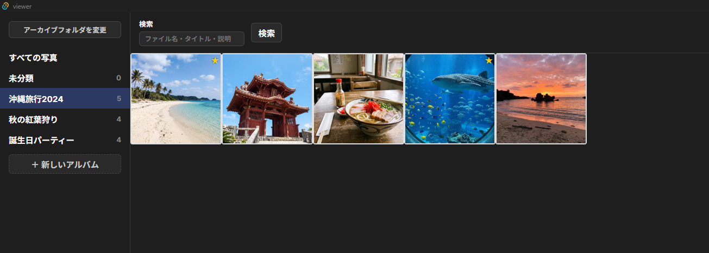
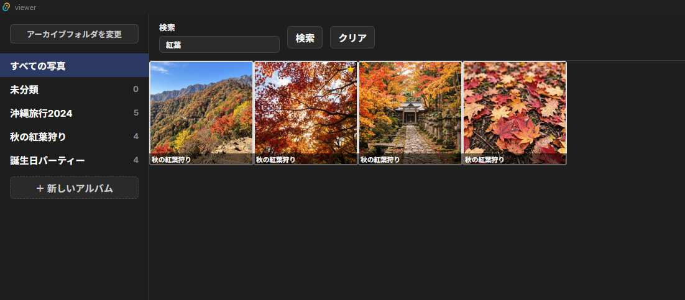
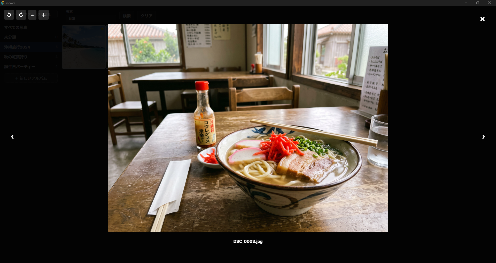

# PhotoLibre

「古いiMacにApple Photos・iPhotoで何年分もため込んだ写真が、そのMac以外ではうまく見られない」——そんな悩みを解決するためのツールです。

PhotoLibreは、Apple Photos/iPhotoの独自仕様から写真を解放し、オープンな形式（SQLite + XMPサイドカー）で管理する、クロスプラットフォーム対応の写真アーカイブ・閲覧ツールです。古いiMac（macOS Big Sur以前）に長年溜め込んだ写真を、Windows/Linux/NASなど別の環境でも自由に閲覧・管理できるようにすることを目指しています。

> 掲載しているスクリーンショットはすべてAI生成のサンプル画像で、実在の人物・実写真は一切含まれていません。

---

## 今、できること

PhotoLibreは現在も開発を続けているプロジェクトですが、iMacからの写真の書き出しから、Windows上での閲覧・整理、デジタルカメラ・SDカード・スマホからの直接取り込みまで、一通りの流れはすでに動作します（各機能の詳細は次の「主な機能」を参照してください）。

開発者自身が実際に持っている写真——Photos.app（Source A）3,545枚、iPhoto（Source B、1998〜2016年分を含む）2,990枚、合計6,535件——を使って、書き出しから閲覧までの動作を確認済みです。Windows用の`.exe`、Linux用の`.deb`/`.rpm`インストーラーは[Releases](https://github.com/ergtronix/photolibre/releases/latest)から配布しています。

---

## スクリーンショット

### 全体表示（写真一覧・グリッドビュー）



### アルバム表示



### 検索（ファイル名だけでなく、所属アルバム名でも検索可能）



### フルスクリーン表示（拡大縮小・回転対応）



---

## 主な機能

**インポーター（`importer/`）**

- osxphotosでエクスポートしたPhotos.app（Source A）・iPhoto（Source B）両方のライブラリを1つのアーカイブへ統合
- SHA-256ハッシュによる重複写真の自動検出（削除はせず`_duplicates/`へ非破壊で退避）
- アルバム名の完全一致・部分集合関係を検出して自動統合（Unicode正規化の違いにも対応）
- 原本ファイルへの書き込みは一切行わない読み取り専用設計

**閲覧アプリ「PhotoLibre」（`viewer/`）**

- 写真グリッド表示・アルバム一覧・「未分類」専用ビュー
- フルスクリーン表示（拡大縮小はボタン・Ctrl+マウスホイール両対応、カーソル位置基準ズーム、ドラッグでのパン移動）
- 写真の手動回転（EXIF自動補正＋手動調整、非破壊）
- お気に入り・年月・キーワードでの絞り込み、ファイル名／タイトル／説明／アルバム名を横断する検索
- アルバムの手動作成・リネーム、複数選択してのドラッグ&ドロップによる写真の分類・未分類への差し戻し
- 上記の分類操作はすべてCtrl+Zで取り消し可能（Undo）
- 動画ファイルはOS標準の動画プレイヤーで再生
- デジタルカメラ・SDカード・スマホから直接、写真/動画をアーカイブへ取り込み（詳細は[Windows側ドキュメント](docs/02-import-and-view-windows.md)の「2-6. デジタルカメラ・SDカード・スマホからの取り込み」を参照）

---

## 技術スタック

技術的な内容に興味がある方向けの参考情報です。使うだけであれば読み飛ばしていただいて構いません。

| 項目 | 内容 |
|---|---|
| インポーター（`importer/`） | Python 3.11+（TDD、pytest、カバレッジ98%） |
| 閲覧アプリ「PhotoLibre」（`viewer/`） | Tauri 2.x（Rust）+ React 19 + TypeScript（TDD、Rust 166テスト・フロントエンド178テスト） |
| データ形式 | SQLite（`archive.db`）+ XMPサイドカー |

---

## 設計方針: 非破壊

写真の原本ファイルは、インポーター・閲覧アプリのどちらからも一切変更しません。

- 重複写真の削除は行わず、`_duplicates/`へ退避して対応関係のみ記録
- 写真の回転は元ファイルを書き換えず、`archive_root/.viewer_state/`に回転角度を別途記録
- 閲覧アプリで行うアルバム分類（作成・リネーム・写真の追加/除外）は`archive.db`内のメタデータのみを更新し、写真ファイル自体には触れない
- アルバムの削除機能は、誤操作のリスクが大きいためアプリ上には意図的に用意していない

---

## セットアップ・使い方

1. [iMac（macOS）側: 写真ライブラリのエクスポート](docs/01-export-macos.md)
2. [Windows・Linux側: インポートとビュワーでの閲覧](docs/02-import-and-view-windows.md)（PhotoLibreアプリは[Releasesページ](https://github.com/ergtronix/photolibre/releases/latest)からWindows（`.exe`）・Linux（`.deb`/`.rpm`）それぞれのインストーラーをダウンロードするだけで導入できます）

---

## Windows SmartScreenの警告について

配布しているインストーラー（`.exe`）は、コード署名証明書を取得していない無料OSSプロジェクトのため未署名です。そのため初回実行時にWindowsが「Windows によって PC が保護されました」という警告（SmartScreen）を表示することがあります。

1. 警告画面の「詳細情報」をクリック
2. 表示される「実行」ボタンをクリック

一度実行すれば、以降は通常通りインストール・起動できます。

---

## Linux版のインストールについて

Linux用インストーラーも、Windows版と同様にコード署名を行っていない未署名パッケージです。そのため、インストール時にGPG検証の警告が表示される場合がありますが、動作に支障はありません。

**`.deb`（Debian/Ubuntu/Linux Mint系）**

```
sudo dpkg -i Photolibre_0.3.2_amd64.deb
```

**`.rpm`（Fedora/RHEL系）**

```
sudo rpm -i Photolibre-0.3.2-1.x86_64.rpm
```

または

```
sudo dnf install Photolibre-0.3.2-1.x86_64.rpm
```

---

## 今後の予定

PhotoLibreは現在も開発を続けているオープンソースプロジェクトです。今のところ、次のような拡張を検討していますが、着手の時期は未定です。

- **iPhoneの標準形式（HEIC）や、各社のRAW形式への対応**: デジタルカメラ・SDカード・スマホからの取り込み機能は、現在この2つの形式に対応していません（詳しくは[Windows側ドキュメント](docs/02-import-and-view-windows.md)の「対応していない形式」を参照）。対応するデコードライブラリの追加を検討しています。
- **閲覧アプリ単体でのアーカイブ新規作成**: 現在、写真アーカイブの最初の作成にはPythonのインポーター（`importer/`）の実行が必要です。将来的には、この最初のセットアップの手間を減らしていきたいと考えています。

ご意見・不具合報告は、GitHubの[Issues](https://github.com/ergtronix/photolibre/issues)からお気軽にお知らせください。

---

## ライセンス

[GNU General Public License v3.0](LICENSE)

誰でも無料で自由に使用・改変・再配布できますが、改変版を配布する場合はそのソースコードも同じGPL v3で公開する必要があります（コピーレフト）。これにより、本プロジェクトが取り込まれてクローズドソースの有料製品として販売されることを防いでいます。
